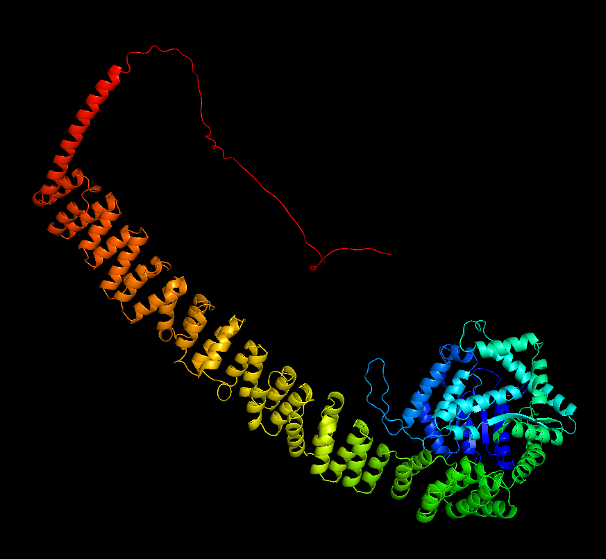

# PDB-Renderer
A simple program to display Protein Data Bank (PDB) protein files in 3D. See `main.py` for example usage. Sample proteins in `proteins` are sourced from RCSB PDB (except the generation, created by myself
using AlphaFold2).

## Controls
- `WASD`: Translate the camera
- `Shift/Space`: Translate the camera vertically
- `Mouse`: Rotate the camera
- `Left/Right Arrow`: Shift which residue is currently highlighted
- `Up/Down Arrow`: Increase and decrease atom point size
- `O`: Toggles atom outline
- `1/2/3/4`: Switch the color palette
- `Esc`: Close the program

## Libraries
- `pyglet 1.5.28` as an OpenGL interface
- `bio 1.6.2` to parse PDB files
- `camera.py` script from https://gist.github.com/mr-linch/f6dacd2a069887a47fbc