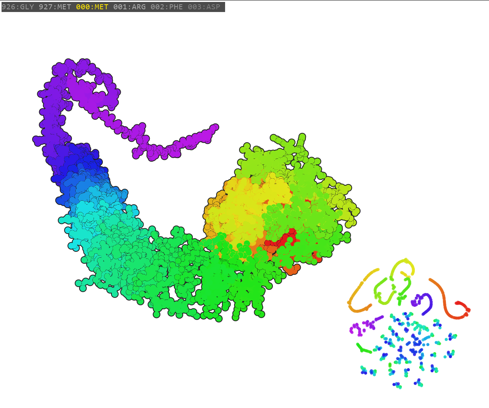

# protein-visualizer
A program to visualize how amino acid residues contribute to protein structure and function.
Work in progress.

## Controls
- `Left Mouse Drag`: Move the camera in both 3D and 2D space
- `Right Mouse Drag`: Rotate the camera in 3D space
- `Left/Right Arrow`: Shift which residue is currently highlighted
- `Up/Down Arrow`: Increase and decrease atom point size
- `O`: Toggles atom outline
- `Esc`: Close the program

## Libraries
- `pyglet 1.5.28` as an OpenGL interface
- `bio 1.6.2` to parse PDB files
- `scikit-learn 1.3.2` for the t-SNE algorithm
- `h5py 3.10.0` to parse h5 database files
- `numpy 1.26.2`
- `colour 0.1.5` for convenient color arithmetic